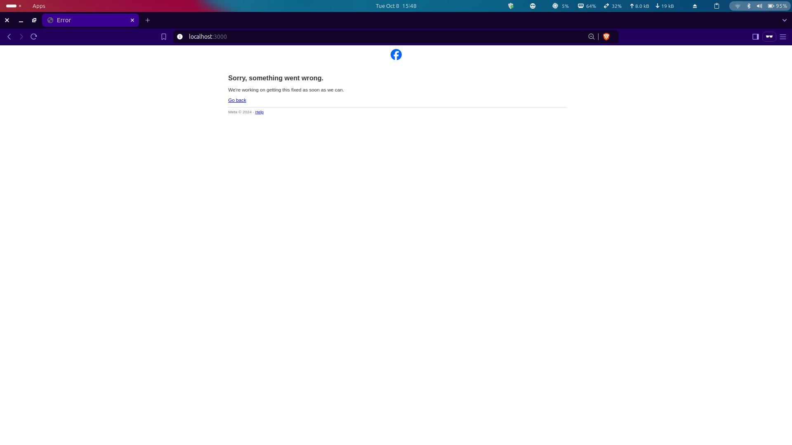
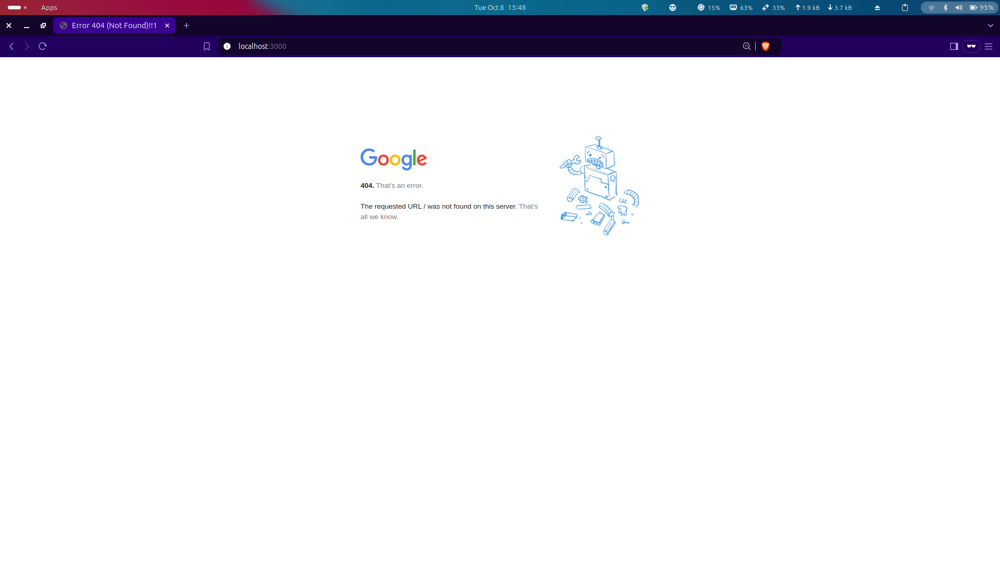
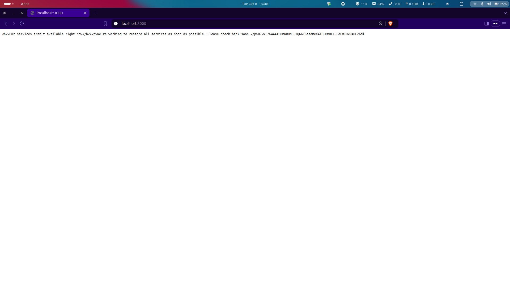

# Load balancer using Golang #

## Round robin method
1. In this repo I have creaated a simple loadbalancer using Go-lang.

2. You can clone this repo using this command :
    ```bash
    git clone https://github.com/drjvtlkr/loadbalancer-golang.git

3. Run the program by running this command : 
    ```bash
    go run main.go

4. You will get this in your terminal
    ```bash
    Serving requests at 'localhost : 3000'

5. Open a browser and open the port 
    ```bash
    localhost:3000

6. You should get something like the snapshots down here

    Here are some screenshots of the load balancer in action:

    
    
    

7. If you do not get these, try opening localhost on Incognito mode
    (I could get it on both normal and Incognito)

## Happy coding